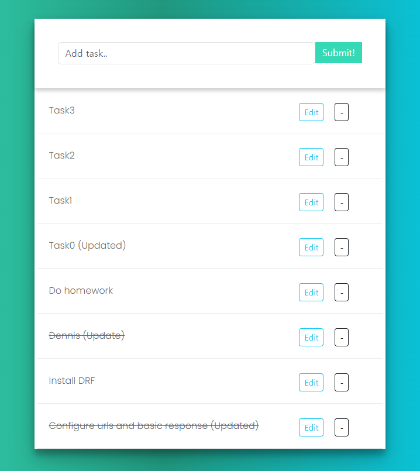

# DjangoRestFramework_ToDoApp
## To-Do App using Django_Rest_Framework and React



## Key Features
1. FrontEnd `(React)`
    1. View task `('http://localhost:8000')`
    2. Add a new task
    3. Edit task
    4. Click to complete (Strike-through)
    5. Delete task

2. API Calls `(Django-Rest-Framework)`
    1. Ordinary view that returns a typical json `('http://localhost:8000/api')`
    2. List view `('http://localhost:8000/api/task-list)`
    3. Detail view `('http://localhost:8000/api/task-detail)`
    4. Create task `('http://localhost:8000/api/task-create)`
    5. Update task `('http://localhost:8000/api/task-update)`
    6. Delete task `('http://localhost:8000/api/task-delete)`

## Run
* Within `todo_drf` directory:
    ```bash
    python manage.py runserver
    ```
* Within `todo_drf/frontend` directory:
    ```bash
    npm install
    npm run dev
    ```

## Reference
[Dennis Ivy - React + Django To-Do App | Django REST Framework](https://www.youtube.com/watch?v=W9BjUoot2Eo)